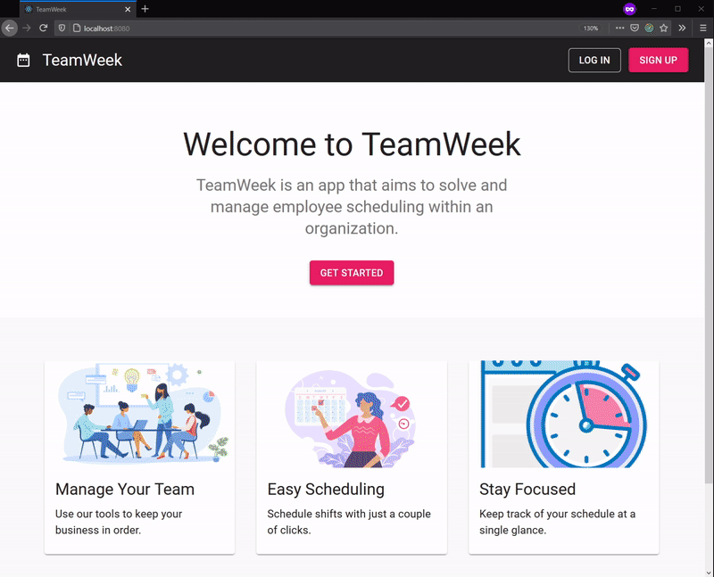

# TeamWeek

Productivity application designed to help business managers schedule and organize their employees.



## Installing

1. Navigate backend directory and install ruby dependencies

   ```bash
   cd backend && bundle install
   ```

2. Seed the database and fire up the rails server

   ```bash
   rails db:migrate && rails db:seed && rails s
   ```

3. Open an additional terminal, nagivate to frontend directory and install react dependencies

   ```bash
    cd .. && cd frontend && npm install
   ```

4. Start react app

   ```bash
    npm start
   ```

## Built with

- [React](https://reactjs.org/)
- [Redux](https://redux.js.org/)
- [Ruby on Rails](https://rubyonrails.org/)
- [Material UI](https://material-ui.com/)
- [LottieFiles](https://lottiefiles.com/)
- [date-fn](https://date-fns.org/)
